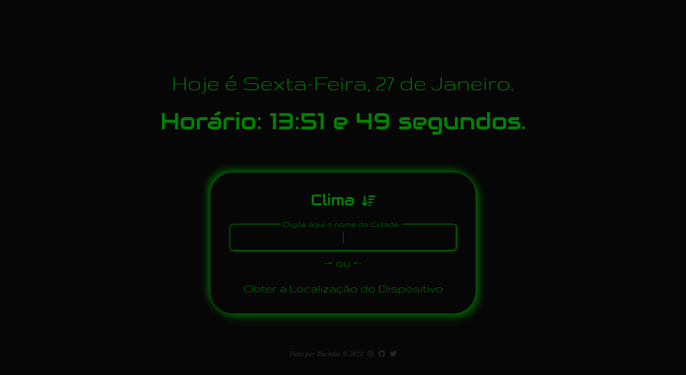

<h1 align="center">
  Relógio & Clima
</h1>

<h4 align="center"><a href="https://wat-tempo.vercel.app/">Clique para visitar o projeto</a></h4>

## 📝 Um pouco sobre

Projeto feito com o intuito de melhorar minhas habilidades com HTML, CSS, JavaScript e consumo de APIs.

_Com o passar do tempo irei atualizando este projeto, provavelmente implementando coisas novas, e também utilizando novas tecnologias._

---

## 💼 Tecnologias utilizadas

Para o desenvolvimento deste site foi utilizado:

- HTML
- CSS
- JavaScript

---

<h2>🤞 Autor</h2>

<table>
  <tr>
    <td align="center">
      <a href="https://github.com/wallacycaike">
         
        
          <b>Wallacy Caike</b>
        
      </a>
    </td>
  </tr>
</table>
